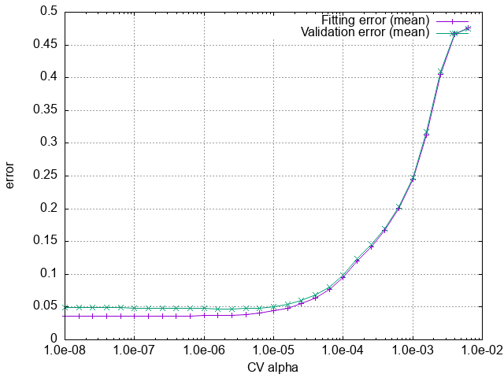

.. _label_tutorial_bto_ifc:

.. raw:: html

    

.. role:: red

.. |Angstrom|   unicode:: U+00C5 

BaTiO\ :sub:`3` : Anharmonic interatomic force constants (IFCs)
---------------------------------------------------

This page explains how to calculate anharmonic interatomic force constants (IFCs) using ALAMODE, especially for strongly anharmonic materials.
The target material is cubic BaTiO\ :sub:`3`, which exhibits a strong lattice anharmonicity.

The example input files are provided in **example/BaTiO3/anharm_IFCs**.

Let's move to the example directory.

.. code-block:: bash

  $ cd ${ALAMODE_ROOT}/example/BaTiO3/anharm_IFCs

.. _tutorial_BTO_IFC_step1:

1. Generate the randomly displaced supercells
~~~~~~~~~~~~~~~~~~~~~~~~~~~~~~~~~~~~~~~

We use the *ab initio* molecular dynamics (AIMD) calculations to generate the supercells with random displacements.

The example VASP inputs are provided in **example/BaTiO3/anharm_IFCs/1_vasp_md**.
Prepare the :red:`POTCAR` file by yourself and run the AIMD calculation to obtain :red:`vasprun.xml`.

Next, we generate the supercells with random atomic displacements from the AIMD trajectory.
First, we move to the **1_configurations** directory and copy :red:`vasprun.xml`

.. code-block:: bash

  $ cd 1_configurations
  $ cp ../1_vasp_md/vasprun.xml ./

:red:`POSCAR_ref_supercell` is the structure of the reference supercell for which we want to calculate the IFCs.

.. code-block:: bash
  $ python3 ${ALAMODE_ROOT}/tools/displace.py --VASP POSCAR_ref_supercell -md vasprun.xml -e 1001:5000:50 --random --mag 0.04 --prefix disp_aimd+random_

Here, the option ``-e 1001:5000:50`` means that we sample from the 1001-th snapshot to the 5000-th snapshot with the sampling step of 50 time-steps.
Thus, 80 configurations are generated in this case.

The option ``--random --mag 0.04`` adds random displacements of 0.04 |Angstrom| to each atom in the extracted snapshots to reduce correlations between successive snapshots.

.. note::

    We may use a less strict convergence criterion in the AIMD calculation because its purpose is just to generate the random structure,
    and the atomic forces obtained in AIMD are not directly used to calculate the IFCs.
    In fact, we use the following parameters, which are different from the subsequent calculation of the displacement-force data.
    
    * ENCUT = 400, EDIFF = 1.0E-6

    * 2x2x2 kmesh

    The temperature in the AIMD calculation is chosen so that the generated trajectory widely samples the 
    low-energy landscape of the potential energy surface. We choose 300 K in this case, which is comparable to
    or lower than the structural transition temperatures of the target material. 

.. note::

    The number of random configurations should be chosen so that the generated set of IFCs
    converges with respect to it.
    Ideally, we should check the convergence of the calculated physical quantities by changing
    the number of random configurations from which we extract the anharmonic IFCs.
    
    It depends on the problems, but a rule of thumb tells us that 100~1000 configurations will do 
    for the calculation of cubic and quartic IFCs.
    We can reduce the number of configurations if we calculate only the cubic IFCs.

.. _tutorial_BTO_IFC_step2:

2. Generate the displacement-force data
~~~~~~~~~~~~~~~~~~~~~~~~~~~~~~~~~~~~~~~

We calculate the atomic forces for each random configuration generated in :ref:`step 1<tutorial_BTO_IFC_step1>`.

The other VASP input files (:red:`INCAR` and :red:`KPOINTS`) are provided in **example/BaTiO3/anharm_IFCs/2_vasp_dfset**.

After collecting the resultant :red:`vasprun.xml` of each calculation in **example/BaTiO3/anharm_IFCs/2_vasp_dfset**, 
generate the displacement-force data with the command

.. code-block:: bash

  $ cd ${ALAMODE_ROOT}/example/BaTiO3/anharm_IFCs
  $ cd 2_vasp_dfset
  $ cp ../1_configurations/POSCAR_ref_supercell ./
  $ python3 ${ALAMODE_ROOT}/tools/extract.py --VASP=POSCAR_ref_supercell vasprun*.xml > DFSET_AIMD_random

The generated :red:`DFSET_AIMD_random` stores the atomic displacements and the atomic forces in each configuration, 
from which we can calculate the anharmonic IFCs.

.. _tutorial_BTO_IFC_step3:

3. Cross validation (CV)
~~~~~~~~~~~~~~~~~~~~~~~~~~~~~~~~~~~~~~~

We assume that the harmonic force constants are already calculated. 
Please use the method explained :ref:`here<label_tutorial_01>` for the calculation of harmonic IFCs.

In the cross validation, we determine the optimal amplitude of regularization (:math:`\alpha`) in the elastic-net or adaptive lasso.
Please see :ref:`the documentation <alm_thoery_enet>` for the notation and the theoretical background.

You can run the CV calculation with the following commands.

.. code-block:: bash 

  $ cd ${ALAMODE_ROOT}/example/BaTiO3/3_cv
  $ ${ALAMODE_ROOT}/alm/alm BTO_alm_cv.in > BTO_alm_cv.log

In :red:`BTO_alm_cv.in`, ``FC2XML = ../cBTO222_harmonic.xml`` means that we fix the harmonic IFCs with the values in the given file.
This is because we would like to capture the stability or the curvature of the potential energy surface at the reference structure accurately.

.. note::
  With ``NBODY = 2 3 3``, we restrict the quartic IFCs to up-to-three-body terms.
  This treatment reduces the computational cost and makes the fitting more robust by reducing the number of degrees of freedom.
  Although the best choice of ``NBODY``-tag will depend on the materials and on the number of your displacement-force data, 
  we recommend restricting the quartic IFCs to up-to-three-body terms and the higher order IFCs to up-to-two-body terms
  since the higher-order IFCs will be more localized in space.

Plotting the generated :red:`cBTO222.cvscore` with 

.. code-block:: bash

  $ gnuplot cv_plot.plt
 
we get the following plot.
Note that you need to set ``STOP_CRITERION = 30`` in ``&optimize``-field to get exactly the same plot.
Otherwise, the calculation is stopped before calculations with small :math:`\alpha` are performed to save the computational cost.

   The result of the CV calculation for BaTiO\ :sub:`3`.

We can see that the CV score takes a minimum at the optimal :math:`\alpha`, which can be read from the last line of :red:`cBTO222.cvscore`.
::
  # Minimum CVSCORE at alpha = 2.51189e-06

.. _tutorial_BTO_IFC_step4:

4. Calculation of IFCs
~~~~~~~~~~~~~~~~~~~~~~~~~~~~~~~~~~~~~~~

Finally, we calculate the IFCs of BaTiO\ :sub:`3` in **example/BaTiO3/anharm_IFCs/4_optimize**.

.. code-block:: bash 

  $ cd ${ALAMODE_ROOT}/example/BaTiO3/4_optimize

To prepare the input file, we copy the input of CV and set ``L1_ALPHA`` with the optimal value 
by adding the new line in ``&optimize``-field.
::
  L1_ALPHA = 2.51189e-06 

Also, change ``CV=4`` in ``&optimize``-field to
::
  CV = 0 # switch off CV

You can also use a smaller value for ``CONV_TOL`` to get a more accurate result.

With the input file prepared, run the calculation with 

.. code-block:: bash

  $ ${ALAMODE_ROOT}/alm/alm BTO_alm_opt.in > BTO_alm_opt.log

The calculated IFCs are written out in :red:`cBTO222.fcs` and :red:`cBTO222.xml`.

Checking :red:`BTO_alm_opt.log`, we can see that the fitting is successful with a small residual error.
::
  RESIDUAL (%): 3.91121

