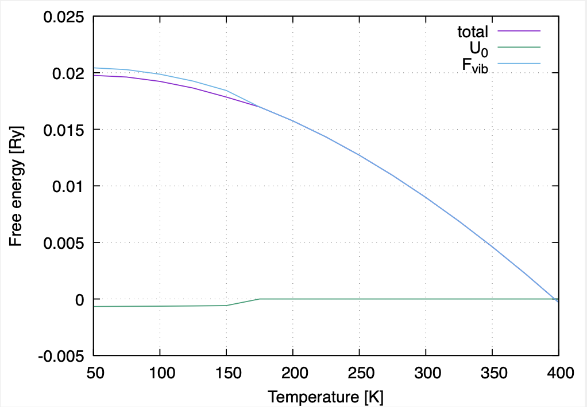

.. _label_tutorial_sto_scph:

.. raw:: html

    

.. role:: red

.. |Angstrom|   unicode:: U+00C5 

BaTiO\ :sub:`3` : An SCPH-based structural optimization example
---------------------------------------------------

This page explains how to calculate crystal structures at finite temperatures based on the SCPH theory.
We calculate the cubic-tetragonal structural phase transition of BaTiO\ :sub:`3`.
We fix the shape of the unit cell and calculate the temperature(:math:`T`)-dependence of the atomic positions.

The example input files are provided in **example/BaTiO3/scph_relax**.

Let's move to the example directory

.. code-block:: bash

  $ cd ${ALAMODE_ROOT}/example/BaTiO3/scph_relax

.. _tutorial_BTO_scph_relax_step1:

1. Prepare force constants
~~~~~~~~~~~~~~~~~~~~~~~~~~~~~~~~~~~~~~~

This tutorial assumes that the harmonic and anharmonic force constants are already calculated up to the fourth order.
Please copy the file of IFCs calculated in :ref:`the previous tutorial<label_tutorial_sto_scph>` to the current directory.

.. code-block:: bash 

  $ cp ../anharm_IFCs/4_optimize/reference/cBTO222.xml.zip
  $ unzip cBTO222.xml.zip

.. note::

  We need to calculate the force constants in the phase with the highest symmetry 
  (cubic phase in the case of BaTiO\ :sub:`3`) to calculate the structural phase transitions. 
  This is because the calculated set of IFCs satisfies the symmetry at this reference structure.

  Suppose we calculate the IFCs at orthorhombic structure, for example. 
  In that case, the generated IFCs do not satisfy the symmetry between the states with opposite polarizations, 
  and the structure will not converge to the high-symmetry cubic phase at high temperatures.

.. _tutorial_BTO_scph_relax_step2:

2. Prepare the input file
~~~~~~~~~~~~~~~~~~~~~~~~~~~~~~~~~~~~~~~

In addition to the input file of the SCPH calculation at the fixed reference structure 
(See :ref:`the tutorial <label_tutorial_sto_scph>` for example), 
we need to set ``RELAX_STR``-tag in ``&scph``-field, ``&relax``-field, and ``&displace``-field properly.

We specify the initial atomic displacements in ``&displace``-field, 
which are added to the high-symmetry reference structure.
This is necessary to induce spontaneous symmetry breaking from the cubic phase.

The input file of the anphon calculation is :red:`BTO_scph_thermo.in`.
The lines
::
  SET_INIT_STR = 3
  COOLING_U0_INDEX = 5
  COOLING_U0_THR = 0.005

are for the cooling calculation. 
With ``SET_INIT_STR = 3``, the initial structure of the SCPH-based structural optimization
is set from ``&displace``-field if the structure at the previous temperature converges to the
high-symmetry phase. 
The structure is considered to be in the high-symmetry phase if the ``COOLING_U0_INDEX`` th component 
of the atomic displacement is smaller than ``COOLING_U0_THR`` [Bohr].
Because we count the components from zero, ``COOLING_U0_INDEX = 5`` means that we focus on 
the :math:`z`-component of the second atom (Ti). 
Please see :ref:`here <anphon_cooling_u0_index>` for more detailed explanations.

To perform the heating calculation, set ``LOWER_TEMP = 0`` in ``&scph``-field and ``SET_INIT_STR = 2``.
Then, write the low-temperature structure to the ``&displace``-field.

.. note::
  We use a coarse SCPH :math:`q`-mesh of ``KMESH_SCPH = 4 4 4`` to save computational cost.
  Convergence with respect to ``KMESH_SCPH`` and the threshold ``COORD_CONV_TOL`` needs 
  to be carefully checked to obtain accurate calculation results.

.. note::

  The convergence of the structure gets significantly slower right at the vicinity of 
  the phase transition because the gradient of the free energy almost vanishes.
  In such cases, getting a smooth :math:`T`-dependence for materials 
  with more complicated structures is sometimes difficult..
  This problem can be partially avoided by choosing a larger :math:`T`-step 
  and estimating the transition temperature from the crossing point of
  the free energies with different phases.

Now, run the calculation with 

.. code-block:: bash

  $ ${ALAMODE_ROOT}/anphon/anphon BTO_scph_thermo.in > BTO_scph_thermo.log

.. _tutorial_BTO_scph_relax_step3:

3. Analyze the calculation results
~~~~~~~~~~~~~~~~~~~~~~~~~~~~~~~~~~~~~~~

Plotting the result with 

.. code-block:: bash

  $ gnuplot plot_structure.plt

you will get the following plot.

The atomic displacements are zero at high temperatures, where the structure converges to 
the high-symmetry cubic phase.
At low temperatures, the atoms are displaced along the :math:`z`-direction,
and the structure is in the tetragonal phase.
The estimated transition temperature (:math:`T_c`) is around 150~175 K.

.. figure:: ../../img/BaTiO3_scph_relax.png
  :scale: 40%
  :align: center

  The :math:`T`-dependence of the atomic displacements in cubic-tetragonal
  structural phase transition of BaTiO\ :sub:`3`.

The plot of the free energy can be obtained with

.. code-block:: bash

  $ gnuplot plot_free_energy.plt

We can see that static energy :math:`U_0` monotonically increases 
while the vibrational free energy :math:`F_{vib}` decreases monotonically with temperature.
Such changes in :math:`U_0` and :math:`F_{vib}` are especially drastic
near the phase transition.
The change of the total free energy is not as significant because the free energies of the two phases
are equal at :math:`T_c`.
Thus, we can see the competition between the enthalpy and the entropic terms in the :math:`T`-dependence
of the crystal structure.

  The :math:`T`-dependence of the free energy in cubic-tetragonal
  structural phase transition of BaTiO\ :sub:`3`.

.. note::

  We can estimate :math:`T_c` more accurately from the crossing point of the free energies of different phases.

  If we perform the cooling calculation without initial displacement, we will get the free energy of the cubic phase with lower temperatures.
  If we perform the heating calculation, we may get the free energy of the tetragonal phase with higher temperatures.
  Then, we can find the crossing point if the :math:`T`-step (``DT``) is small enough.
  If ``DT`` is too large to see the crossing point and the hysteresis, 
  we can extrapolate the free energy difference :math:`F_{cubic}-F_{tetra}` from the low temperature to estimate :math:`T_c`.

.. note::

  BaTiO\ :sub:`3` shows a three-step structural phase transition between four different phases.
  For the other two phase transitions that occur at lower temperatures (tetragonal-orthorhombic and orthorhombic-rhombohedral transition),
  the symmetry of the low-:math:`T` phases are not subgroups of the symmetry of the high-:math:`T` phases.

  In such cases, we recommend calculating cubic-orthorhombic and cubic-rhombohedral phase transitions separately 
  and comparing the free energies because

  * The calculated hysteresis does not necessarily reflect the physics if the transition is strongly first-order.

  * The symmetry makes the calculation more stable and efficient. If we directly calculate the tetra-ortho transition, the symmetry 
    used in the calculation is the common subgroup of the symmetry groups of these two phases, while we can take advantage of the full symmetry of
    the orthorhombic phase if we calculate the cubic-ortho transition instead.

.. note::
  
  We will need to prepare additional inputs, the elastic constants, and the strain-harmonic-IFC coupling if we relax the unit cell as well.
  The strain-force coupling is not necessary for BaTiO\ :sub:`3` because they are zero from symmetry.

  Please see the :ref:`following tutorial <label_tutorial_zno_qha_relax>` for the details of the preparation of these inputs.
