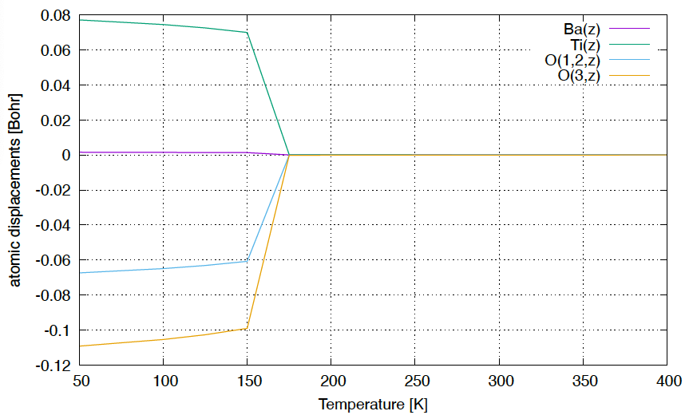

.. _label_tutorial_sto_scph:

.. raw:: html

    

.. role:: red

.. |Angstrom|   unicode:: U+00C5 

BaTiO\ :sub:`3` : An SCPH-based structural optimization example
---------------------------------------------------

This page explains how to calculate crystal structures at finite temperatures based on the SCPH theory.
We calculate the cubic-tetragonal structural phase transition of BaTiO\ :sub:`3`.
We fix the shape of the unit cell and calculate the temperature(:math:`T`)-dependence of the atomic positions.

The example input files are provided in **example/BaTiO3/scph_relax**.

Let's move to the example directory

.. code-block:: bash

  $ cd ${ALAMODE_ROOT}/example/BaTiO3/scph_relax

.. _tutorial_BTO_scph_relax_step1:

1. Prepare force constants
~~~~~~~~~~~~~~~~~~~~~~~~~~~~~~~~~~~~~~~

In this tutorial, we assume that the harmonic and the anharmonic force constants are already calculated up to 4th order.
Please copy the file of IFCs calculated in :ref:`the previous tutorial<label_tutorial_sto_scph>` to the current directory.

.. code-block:: bash 
  $ cp ../anharm_IFCs/4_optimize/reference/cBTO222.xml.zip
  $ unzip cBTO222.xml.zip

.. _tutorial_BTO_scph_relax_step2:

2. Prepare the input file
~~~~~~~~~~~~~~~~~~~~~~~~~~~~~~~~~~~~~~~

In addition to the input file of the SCPH calculation at the fixed reference structure 
(See :ref:`tutorial <label_tutorial_sto_scph>` for example), 
we need to set ``RELAX_STR``-tag in ``&scph``-field, the ``&relax``-field, and the ``&displace``-field properly.

We specify the initial atomic displacements, which are added to the high-symmetry reference structure,
in ``&displace``-field.
This is necessary to induce spontaneous symmetry breaking from the cubic phase.

The input file of the anphon calculation is :red:`BTO_scph_thermo.in`.
The lines
::
  SET_INIT_STR = 3
  COOLING_U0_INDEX = 5
  COOLING_U0_THR = 0.005

are for the cooling calculation. 
With ``SET_INIT_STR = 3``, the initial structure of the SCPH-based structural optimization
is set from the ``&displace``-field if the structure at the previous temperature converges to the
high-symmetry phase. 
The structure is considered to be in the high-symmetry phase if the ``COOLING_U0_INDEX`` th component 
of the atomic displacement is smaller than ``COOLING_U0_THR`` [Bohr].
Because we count the components from zero, ``COOLING_U0_INDEX = 5`` means that we focus on 
the :math:`z`-component of the second atom (Ti). 
Please see :ref:`here <anphon_cooling_u0_index>` for more detailed explanations.

To perform the heating calculation, set ``LOWER_TEMP = 0`` in ``&scph``-field and ``SET_INIT_STR = 2``.
Then, write the low-temperature structure to the ``&displace``-field.

Now, run the calculation with 

.. code-block:: bash

  $ ${ALAMODE_ROOT}/anphon/anphon BTO_scph_thermo.in > BTO_scph_thermo.log

.. _tutorial_BTO_scph_relax_step3:

3. Analyze the calculation results
~~~~~~~~~~~~~~~~~~~~~~~~~~~~~~~~~~~~~~~

Plotting the result with 

.. code-block:: bash

  $ gnuplot plot.plt

you will get the following plot.

The atomic displacements are zero at high temperatures, where the structure converges to 
the high-symmetry cubic phase.
At low temperatures, the atoms are displaced along the :math:`z`-direction and the structure 
is in the tetragonal phase.

  The :math:`T`-dependence of the atomic displacements in cubic-tetragonal
  structural phase transition of BaTiO\ :sub:`3`.
