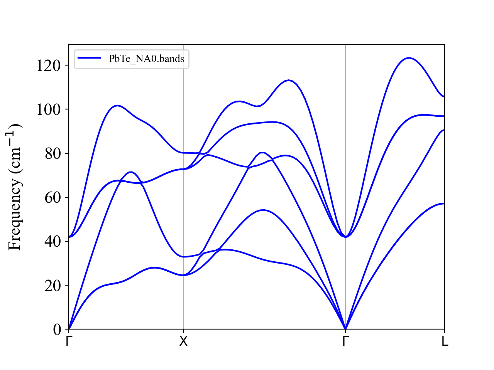
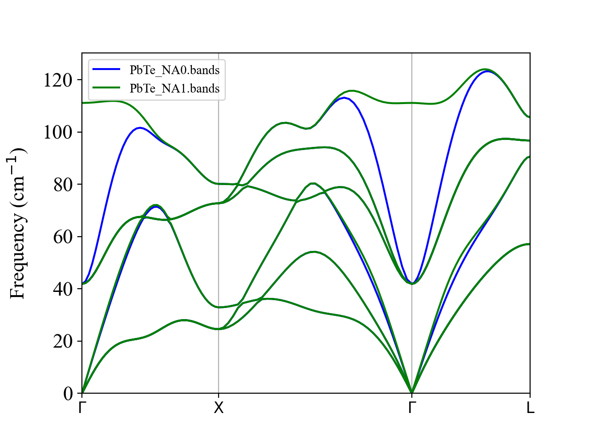
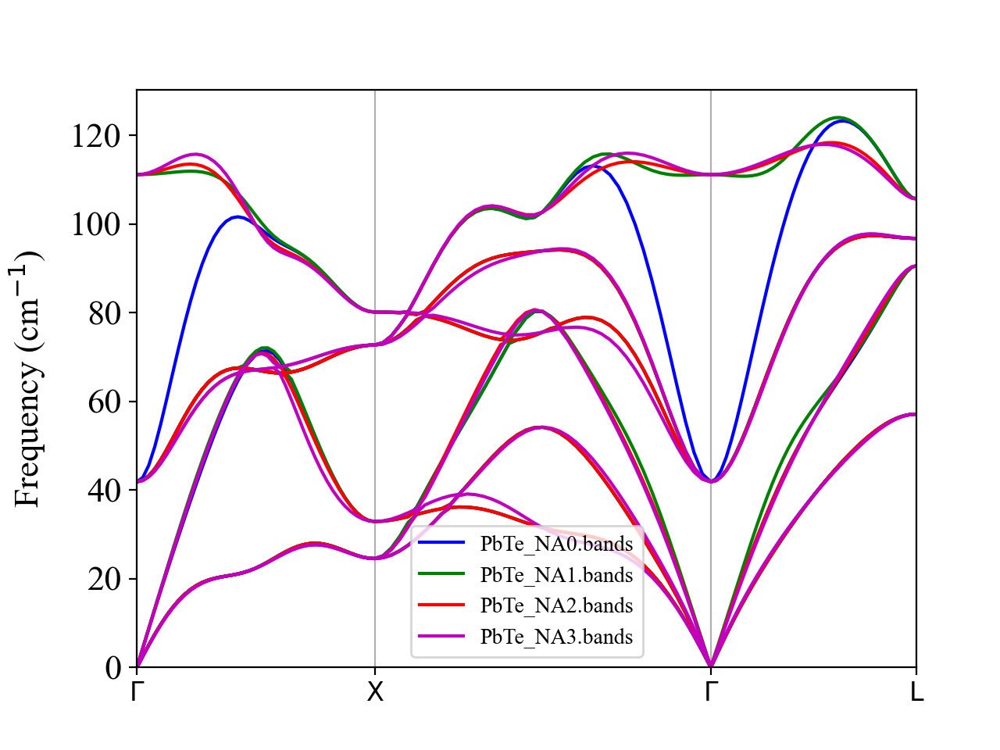

.. _label_tutorial_pbte:

.. raw:: html

    

.. role:: red

PbTe (non-analytic correction)
------------------------------

This part demonstrates how to include the non-analytic correction in phonon and thermal conductivity calculations of polar semiconductors.

All input files can be found at the **example/PbTe** subdirectory.

Let's move to the example directory

.. code-block:: bash

  $ cd ${ALAMODE_ROOT}/example/PbTe

.. _tutorial_PbTe_step1:

1. Build a supercell and generate displacements
~~~~~~~~~~~~~~~~~~~~~~~~~~~~~~~~~~~~~~~~~~~~~~~

In this tutorial, we build a 4x4x4 supercell of the primitive cell of PbTe containing 2 atoms.
The crystal structure of the primitive cell in the VASP POSCAR format is

.. literalinclude:: ../../../example/PbTe/vasp_inputs/POSCAR

Now, let's construct a 4x4x4 supercell. 
This can be done by creating a simple script by yourself or using a method implemented in popular libraries, such as ``ase`` or ``pymatgen``.
This time, we will use the python script ``makedisp_vasp.py`` in the working directory. To use this script, ``pymatgen`` needs to be installed (if you have not):

.. code-block:: bash

    $ conda activate alm 
    $ conda install -c conda-forge pymatgen

Then, edit the header part of the script.

.. literalinclude:: ../../../example/PbTe/makedisp_vasp.py
    :lines: 9-18

Here, the scaling matrix (:math:`M_{p\rightarrow s}`) is the matrix that transforms the primitive lattice vectors :math:`(\boldsymbol{a}_p, \boldsymbol{b}_p, \boldsymbol{c}_p)` into the supercell lattice vectors as :math:`(\boldsymbol{a}_s, \boldsymbol{b}_s, \boldsymbol{c}_s) = (\boldsymbol{a}_p, \boldsymbol{b}_p, \boldsymbol{c}_p) M_{p\rightarrow s}`.

``POSCARname`` is the file name of the primitive POSCAR file, ``prefix`` is used for ``PREFIX`` of **ALM**, ``prefix_poscar`` is used for the file names of the displaced SPOSCARS. 

By issuing the command

.. code-block:: bash

    $ python makedisp_vasp.py

the script generates a supercell (``SPOSCAR``), generates an input for **alm** (``ALM0.in``), run **alm**, and passes the output files to ``displace.py``.
The above command finishes quickly, and you can find two displaced structures (``harm_0.01_{1,2}.POSCAR``) generated in the working directory.

2. Run DFT calculations and get forces
~~~~~~~~~~~~~~~~~~~~~~~~~~~~~~~~~~~~~~

Next, please perform DFT calculation and compute forces for the two displaced configurations. 
This can be done easily, for example, as

.. code-block:: bash

    #!/bin/bash

    for ((i=1;i<=2;i++))
    do
        cp harm_0.01_${i}.POSCAR POSCAR
        mpirun vasp_std
        mv OUTCAR OUTCAR.${i}
        mv vasprun.xml vasprun_${i}.xml
    done

When all calculations are done, please collect the displacement-force datasets as

.. code-block:: bash

    $ python ${ALAMODE_ROOT}/tools/extract.py --VASP SPOSCAR vasprun_?.xml > DFSET_harmonic

In this tutorial, we have placed the VASP outputs in ``vasp_outputs/`` directory, so you can skip the VASP calculations by using the ``vasprun_?.xml`` files in that directory as

.. code-block:: bash

    $ python ${ALAMODE_ROOT}/tools/extract.py --VASP SPOSCAR vasp_outputs/vasprun_?.xml > DFSET_harmonic

3. Fit second-order force constants
~~~~~~~~~~~~~~~~~~~~~~~~~~~~~~~~~~~

Please just run

.. code-block:: bash

    $ python makedisp_vasp.py DFSET_harmonic

The script generates an input for **alm** (``ALM1.in``) and calls **alm**. Please check if the fitting error in the log file (``ALM1.log``) is reasonably small. The second-order force constants are saved in ``super444_0.01.xml``.

4. Compute dielectric tensor and Born effective charges
~~~~~~~~~~~~~~~~~~~~~~~~~~~~~~~~~~~~~~~~~~~~~~~~~~~~~~~

To include the non-analytic correction, one needs to give the electronic permittivity tensor (:math:`\epsilon_{\infty}`) and the Born effective charges.
This can be done conveniently using density functional perturbation theory (DFPT), which is available in major DFT codes (e.g., VASP, Quantum-ESPRESSO, abinit).

In VASP, for example, you just need to add `LEPSILON = .True. <https://www.vasp.at/wiki/index.php/LEPSILON>`_ in INCAR. For orbital dependent functionals, this option is not supported, and `LCALCEPS = .True. <https://www.vasp.at/wiki/index.php/LCALCEPS>`_ should be used instead.

.. important:: 

    Please run a DFPT calculation using the primitive cell you used to generate the supercell. If these two structures are inconsistent, the order of the atoms and Born effective charges may change, which likely results in strange phonon band dispersion.

Once the DFPT calculation finishes, please parse the electronic permittivity tensor and Born effective charges from the output file and save them in a single file following the specific format described in :ref:`label_format_BORNINFO`.

If you used VASP, the ``BORNINFO`` file can be created by issuing

.. code-block:: bash

    $ python ${ALAMODE_ROOT}/tools/extract.py --POSCAR --get born vasprun.xml > PbTe.born

Currently, this parsing feature is supported only for VASP.

We provide the pre-generated file ``PbTe.born`` in the ``reference/`` directory, so you can copy it to the working directory to move forward.

5. Phonon calculations
~~~~~~~~~~~~~~~~~~~~~~

All inputs are ready, so we can start phonon calculations. 

We first compute phonon dispersion without non-analytic (NA) correction. 
The input file for **anphon** (``phband.in``) looks like

.. literalinclude:: ../../../example/PbTe/reference/phband.in

Please run **anphon** and plot the bands file

.. code-block:: bash

    $ ${ALAMODE_ROOT}/bin/anphon/anphon phband.in > phband.log
    $ python ${ALAMODE_ROOT}/tools/plotband.py PbTe_NA0.bands

We can see that the TO and LO phonons are degenerate at :math:`\boldsymbol{q}=0` and the optical phonon frequencies go down rapidly as approaching to :math:`\boldsymbol{q}\longrightarrow 0`.

Next, let us consider the NA correction. 
Please change the ``PREFIX`` and ``NONANALYTIC`` tags as 

.. code-block:: 

    PREFIX = PbTe_NA1
    NONANALYTIC = 1; NA_SIGMA = 0.15

This option activates the Parlinski's approach with the damping factor of :math:`\sigma = 0.15`.
After running **anphon** again, we can compare phonon dispersion curves with and without the NA correction.

.. code-block:: bash

    $ ${ALAMODE_ROOT}/bin/anphon/anphon phband.in > phband.log2
    $ python ${ALAMODE_ROOT}/tools/plotband.py PbTe_NA0.bands PbTe_NA1.bands

The LO-TO splitting occurs as expected. 

Please repeat the above calculations with the other ``NONANALYTIC`` options (``NONANALYTIC=2`` (mixed-space) and ``NONANALYTIC=3`` (Ewald method)).
Finally, we plot all results together to see the difference.

.. code-block:: bash

    $ python ${ALAMODE_ROOT}/tools/plotband.py PbTe_NA?.bands

We can see that ``NONANALYTIC=2`` and ``NONANALYTIC=3`` give smoother dispersion than ``NONALAYTIC=1``. 
For these two method, the NA correction becomes exactly zero at the commensurate :math:`\boldsymbol{q}` points (other than :math:`\boldsymbol{q}\longrightarrow 0`). In the present calculation, we used a 4x4x4 supercell of the primitive cell. Hence, the NA correction should be zero at the Brillouin zone boundaries (X and L points) as well as the midpoint of the each high-symmetry line (e.g., :math:`\boldsymbol{q}=(1/4, 1/4, 0)`). We can confirm this from the above figure, where the blue, red, and magenta curves perfectly intersect with each other at these commensurate points, whereas the green curve does not.

In general, we recommend using ``NONANALYTIC=3`` as it correctly separates the short- and long-range terms and calculates the NA correction in the reciprocal space accurately using the Ewald summation method. It can also avoid abrupt jumps or discontinuties in dispersion curves at Brillouin zone boundaries, which can happen with ``NONALALYTIC=2`` when the BZ boundary is not commensurate with the supercell size.