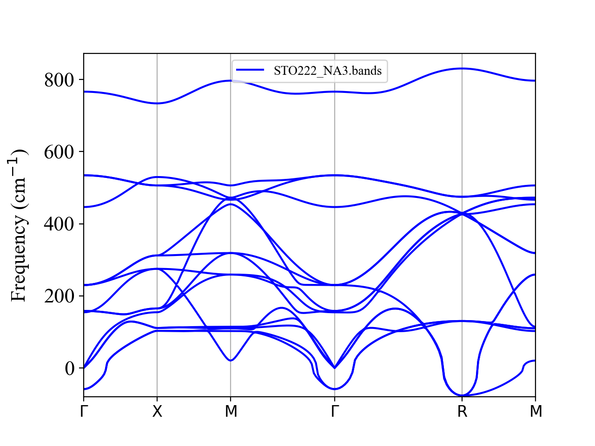
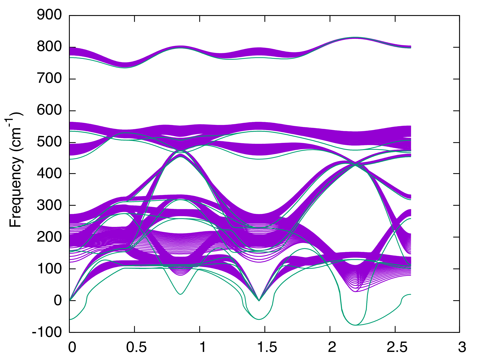
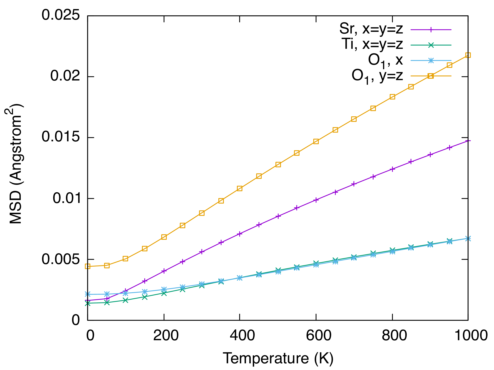

.. _label_tutorial_sto_scph:

.. raw:: html

    

.. role:: red

SrTiO\ :sub:`3` : A self-consistent phonon example
---------------------------------------------------

This page explains how to run an self-consistent phonon (SCP) calculation using ALAMODE.
The target materials is cubic SrTiO\ :sub:`3`, which is a well-known perovskite solid exhibiting soft phonons.

The example input files are provided in **example/SrTiO3/reference**.

Let's move to the example directory

.. code-block:: bash

  $ cd ${ALAMODE_ROOT}/example/SrTiO3

.. _tutorial_STO_step1:

1. Prepare force constants and BORNINFO
~~~~~~~~~~~~~~~~~~~~~~~~~~~~~~~~~~~~~~~

In this tutorial, we assume that the harmonic and anharmonic force constants (up to 4th order) are already calculated and only focus on the SCP calculation part. The tutorial for calculating anharmonic force constants is given in another page.

To start an SCPH calculation, please copy the force constant files and BORNINFO as follows:

.. code-block:: bash

    $ cp reference/STO_anharm.xml.bz2 .
    $ bunzip2 STO_anharm.xml.bz2
    $ cp reference/BORN .

.. note::

    The anharmonic force constants were computed using the following settings:

    * VASP, PBEsol, ENCUT = 550 eV

    * 2x2x2 supercell of cubic SrTiO\ :sub:`3` (40 atoms)

    * Harmonic force constants were computed using ordinary least squares

    * Anharmonic force constants were estimated using LASSO from 40 training structures

    For more details, please see the `original paper <https://arxiv.org/abs/1506.01781>`_.

.. _tutorial_STO_step2:

2. Phonons within the harmonic approximation
~~~~~~~~~~~~~~~~~~~~~~~~~~~~~~~~~~~~~~~~~~~~

Before moving onto an SCP calculation, let's first confirm that the cubic STO is dynamically unstable within the harmonic approximation.

Please prepare an input file for band structure calculation (``phband.in``) as follows:

.. literalinclude:: ../../../example/SrTiO3/reference/phband.in

Please run **anphon** and plot the band structure as

.. code-block:: bash

    $ ${ALAMODE_ROOT}/anphon/anphon phband.in > phband.log
    $ python ${ALAMODE_ROOT}/tools/plotband.py STO222_NA3.bands

It is clear that phonons are dynamically unstable at the :math:`\Gamma` and R points.

.. _tutorial_STO_step3:

3. Phonons within the self-consistent phonon method
~~~~~~~~~~~~~~~~~~~~~~~~~~~~~~~~~~~~~~~~~~~~~~~~~~~

Now, let's include the finite-temperature effect using the SCP method.

Please copy ``phband.in`` to ``scph.in`` and edit ``scph.in`` as follows:

.. literalinclude:: ../../../example/SrTiO3/reference/scph.in
   :emphasize-lines: 2-3, 7, 26-32

Here, the ``&scph`` field is added to the input. 
The important parameters for the SCP calculation are :ref:`KMESH_INTERPOLATE <anphon_kmesh_interpolate>` and :ref:`KMESH_SCPH <anphon_kmesh_scph>`. The former defines the :math:`\boldsymbol{q}`\ -point mesh used to solve the SCP calculation and perform (inverse) Fourier transformation of dynamical matrices, while the latter defines the :math:`\boldsymbol{q}`\ -point mesh used to compute the renormalization term associated with the loop self-energy diagram. Also, :ref:`SELF_OFFDIAG <anphon_self_offdiag>` option controls whether the off-diagonal components of the loop self-energy are considered or not. In the above example, we neglect the off-diagonal components to make the calculation faster. We will see the effect of the off-diagonal components later.

.. important:: 

    All :math:`\boldsymbol{q}` points generated by :ref:`KMESH_INTERPOLATE <anphon_kmesh_interpolate>` should be commensurate with the supercell size (of the harmonic force constant calculation) because :math:`\Delta D(\boldsymbol{q}) = D_{\mathrm{SCPH}}(\boldsymbol{q}) - D_{\mathrm{HA}}(\boldsymbol{q})` is used to interpolate dynamical matrix, for which :math:`D_{\mathrm{HA}}(\boldsymbol{q})` should be exact within the harmonic approximation (HA). In the above example, we employ a 2x2x2 supercell, so we should use ``KMESH_INTERPOLATE = 2 2 2`` (or ``KMESH_INTERPOLATE = 1 1 1``, which is less accurate).

.. important:: 

    The :math:`\boldsymbol{q}_1` points generated by :ref:`KMESH_SCPH <anphon_kmesh_scph>` can be denser than :ref:`KMESH_INTERPOLATE <anphon_kmesh_interpolate>`, but the latter coarser grid must be a subset of the former denser grid. For example, when we use ``KMESH_INTERPOLATE = 2 2 2``, we can set ``KMESH_SCPH = 2 2 2``, ``KMESH_SCPH = 4 4 4``, and so forth, but ``KMESH_SCPH = 3 3 3``, ``KMESH_SCPH = 5 5 5``, ... are not allowed.

Now, let's run **anphon** using MPI parallelization.

.. code-block:: bash
    
    $ export OMP_NUM_THREADS=1
    $ mpirun -np 4 ${ALAMODE_ROOT}/anphon/anphon scph.in > scph.log

The calculation finishes in ~2 minutes. When it is done, please check if the SCPH iteration reached convergence.

.. code-block:: bash
    
    $ grep "conv" scph.log

We can see that the SCPH loop converged except for :math:`T = 0` K.
In the working directory, the following files are created:

- ``STO_scph2-2.scph_dymat`` : Anharmonic corrections to the dynamical matrix, :math:`\Delta D(\boldsymbol{q}, T) = D_{\mathrm{SCPH}}(\boldsymbol{q}, T) - D_{\mathrm{HA}}(\boldsymbol{q})`, are stored. This file can be used to restart an SCP calculation with the same ``KMESH_*`` and ``SELF_OFFDIAG`` parameters.
- ``STO_scph2-2.scph_dfc2`` : Anharmonic corrrections to the second-order force constants, :math:`\Delta \Phi(\boldsymbol{r}(\ell), T) = M^{\frac{1}{2}} \Delta D(\boldsymbol{r}(\ell), T) M^{\frac{1}{2}}`, are stored, where :math:`M` is the diagonal matrix whose elements are atomic masses, and :math:`\Delta D(\boldsymbol{r}(\ell), T) = N_{q}^{-1} \sum_{\boldsymbol{q}} \Delta D(\boldsymbol{q}, T) e^{-i\boldsymbol{q}\cdot\boldsymbol{r}(\ell)}`. This file is used to create effective second-order force constants via ``dfc2`` (for ALAMODE FCSXML format) or ``scph_to_qefc.py`` (Quantum-ESPRESSO fc format).
- ``STO_scph2-2.scph_bands`` : Self-consistent phonon band structures at various temperatures.

Let's plot the finite-temperature band structures.

.. code-block:: bash

    $ gnuplot
    gnuplot> set terminal qt font "Helvetica,20"
    gnuplot> set ylabel "Frequency (cm^{-1})"
    gnuplot> unset key
    gnuplot> plot for [col=3:17] "< awk '{if ($1!=0.0) print $0}' STO_scph2-2.scph_bands" u 2:col w l lt 1
    gnuplot> replot for [col=2:16] "STO222_NA3.bands" u 1:col w l lt 2

The soft modes are stabilized by the SCP calculation and exhibit significant temperature dependences.

.. note:: 

    If you are interested, please check the dependencies of the results on ``SELF_OFFDIAG`` and ``KMESH_SCPH`` values.

.. _tutorial_STO_step4:

4. Thermodynamics from the self-consistent phonon method
~~~~~~~~~~~~~~~~~~~~~~~~~~~~~~~~~~~~~~~~~~~~~~~~~~~~~~~~

We next compute various thermodynamic functions, including the vibrational free energy, mean square displacement (MSD), using the SCP calculation.
Please copy ``scph.in`` to ``scph2.in`` and edit ``scph2.in`` as follows:

.. literalinclude:: ../../../example/SrTiO3/reference/scph2.in
   :emphasize-lines: 8, 18-21, 31-33

We use the same ``PREFIX`` as before so that the code can restart the calculation from ``STO_scph2-2.scph_dymat``. 
The code can skip the most expensive part of the SCP calculation, so we run **anphon** without MPI:

.. code-block:: bash

    $ ${ALAMODE_ROOT}/anphon/anphon scph2.in > scph2.log

When the calculation finishes, the following files are created in the working directory:

- ``STO_scph2-2.scph_dos`` : Phonon density of states at various temperatures
- ``STO_scph2-2.scph_msd`` : Temperature-dependent MSDs for each atom
- ``STO_scph2-2.scph_thermo`` : Heat capacity and vibrational free energies at various temperatures

These files can be plotted and processed easily. For example, let's plot the MSD of Sr, Ti, and O atoms using gnuplot.

.. code-block:: bash

    $ gnuplot
    gnuplot> set terminal qt font "Helvetica,20"
    gnuplot> set xlabel "Temperature (K)"
    gnuplot> set ylabel "MSD (Angstrom^{2})"
    gnuplot> plot "STO_scph2-2.scph_msd" u 1:2 ti "Sr, x=y=z"
    gnuplot> replot "STO_scph2-2.scph_msd" u 1:5 ti "Ti, x=y=z"
    gnuplot> replot "STO_scph2-2.scph_msd" u 1:8 ti "O_1, x"
    gnuplot> replot "STO_scph2-2.scph_msd" u 1:9 ti "O_1, y=z"

We can see that the MSD of an oxygen is large in the plane perpendicular to the nearest Ti-O bond direction.

In the ``STO_scph2-2.scph_thermo`` file, vibrational free energies within the SCP theory are stored, which can be used to predict phase stability and thermal expansitivy of anharmonic materials. In the file, 3-5 columns give vibrational free energies.

.. code-block:: bash

    $ head -n 10 STO_scph2-2.scph_thermo

.. literalinclude:: ../../../example/SrTiO3/reference/STO_scph2-2.scph_thermo
    :lines: 1-10

The 3rd column is the QHA-like term and the 4th column is the correction term necessary for the vibrational free energy to satisfy the thermodynamic condition of :math:`S_{\mathrm{vib}}=-\frac{dF_{\mathrm{vib}}}{dT}` . The 5th column is the sum of the 3rd and 4th columns, which gives the correct vibrational free energy within the SCP scheme. So, the values in the 5th column should be used for phase stability and thermal expansivity calculations.

.. important:: 

    Since the SCP calculation did not converge at 0 K, the thermodynamic quantities at 0 K are incorrect and should not be used for any purposes.