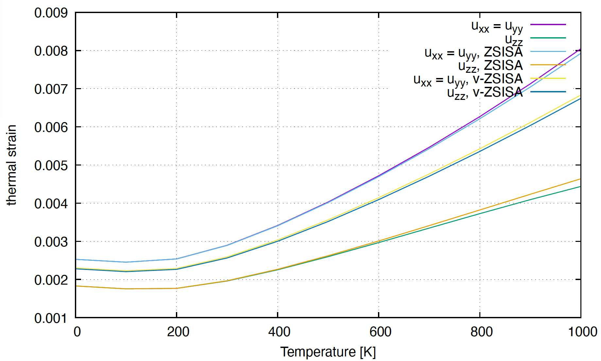

.. _label_tutorial_zno_qha_relax:

.. raw:: html

    

.. role:: red

.. |Angstrom|   unicode:: U+00C5 

ZnO : A QHA-based structural optimization example
---------------------------------------------------

This page explains how to calculate crystal structures at finite temperatures (:math:`T`) based on the quasiharmonic approximation (QHA).

Let's move to the example directory

.. code-block:: bash

  $ cd ${ALAMODE_ROOT}/example/ZnO/qha_relax

.. _tutorial_ZnO_QHA_step1:

1. Prepare force constants
~~~~~~~~~~~~~~~~~~~~~~~~~~~~~~~~~~~~~~~

This tutorial assumes that the harmonic and anharmonic force constants are already calculated up to fourth order. 
Here, please unzip all the XML files in **example/ZnO/qha_relax** and **example/ZnO/qha_relax/strain_IFC** before running the calculation.

.. note::
  We use the harmonic IFCs calculated in the :math:`4\times 4\times 2` supercell 
  and the anharmonic IFCs calculated in the :math:`3\times 3\times 2` supercell
  due to the high computational cost of the DFT calculations for the 
  anharmonic IFCs.
  This treatment is justified because the higher-order IFCs tend to be more localized 
  in real space.

.. _tutorial_ZnO_QHA_step2:

2. Prepare the additional input files.
~~~~~~~~~~~~~~~~~~~~~~~~~~~~~~~~~~~~~~~

We need to calculate the elastic constants, the strain-force coupling, and the strain-harmonic-IFC coupling
to calculate the :math:`T`-dependence of the shape of the unit cell.
The recommended way to hand them to :red:`anphon` is the strain-coupling container, one HDF5 file
given as ``STRAINFILE`` in the ``&relax`` field: :red:`strain_IFC/ZnO.strain.h5` of this example holds
all of them, and :red:`ZnO_qha_thermo_strainfile.in` is the input using it. The container is written by
the Python tools :red:`elastic.py` (elastic constants and, from the same strained primitive cells, the
strain-force coupling) and :red:`strainifc.py` (strain-harmonic-IFC coupling) with ``--strain-file``
from DFT calculations of strained cells, or packed from the text files with :red:`strainfile.py`; ``strainfile.py show`` and
``strainfile.py check`` inspect it and verify it against the planned run. See
:ref:`this page <label_strain_tools>` for the full description and ``example/ZnO/strain_IFC_workflow``
for template inputs. All quantities are the clamped-ion ones (fixed fractional coordinates), because
the internal coordinates are optimized explicitly by :red:`anphon`.

The rest of this section describes the legacy text files, which :red:`ZnO_qha_thermo.in` still uses:
they are placed in the directory named as the value of the ``STRAIN_IFC_DIR``-tag (except
:red:`C1_array.in`, which is read from the working directory of :red:`anphon`). The container stores the
same quantities, with the units as attributes and the reference structure once.

* The second-order elastic constants (SOEC) and the third-order elastic constants (TOEC) are read from
  :red:`elastic_constants.in`, whose format is as follows.
  ::

    SOEC GPa
    C_xx,xx
    C_xx,xy
    C_xx,xz
    ...
    C_zz,zz
    TOEC GPa
    C_xx,xx,xx
    C_xx,xx,xy
    ...
    C_zz,zz,zz

  :math:`C_{\mu_1 \nu_1, \mu_2 \nu_2} = \frac{1}{V}\frac{\partial^2 U}{\partial \eta_{\mu_1 \nu_1} \partial \eta_{\mu_2 \nu_2}}`,
  :math:`C_{\mu_1 \nu_1, \mu_2 \nu_2, \mu_3 \nu_3} = \frac{1}{V}\frac{\partial^3 U}{\partial \eta_{\mu_1 \nu_1} \partial \eta_{\mu_2 \nu_2} \partial \eta_{\mu_3 \nu_3}}`
  are the second-order and third-order (Brugger) elastic constants, i.e., the derivatives with respect to the
  Green-Lagrange strain :math:`\eta = \mathrm{sym}(u) + \frac{1}{2}u u^{T}` of the deformation gradient :math:`F = I + u`,
  given in GPa: the unit token ``GPa`` after each label tells :red:`anphon` to multiply the values by the volume
  of its primitive cell, so the file does not depend on the size of the cell given in the ``&cell`` field. Files without the unit token
  (the legacy layout, used by the :red:`elastic_constants.in` shipped with this tutorial) hold
  :math:`V_{cell} C` in Rydberg unit, where :math:`V_{cell}` is the volume of the unit cell given in the
  ``&cell`` field. The residual stress of the reference structure, :math:`\sigma_{\mu\nu}` in GPa, can be
  given in :red:`C1_array.in` (``C1 GPa`` followed by nine values; without the token, :math:`V_{cell}\sigma_{\mu\nu}`
  in Rydberg unit) placed in the working directory of :red:`anphon`.

  These files can be generated with :red:`elastic.py`: ``elastic.py generate`` writes strained primitive cells,
  and after the DFT calculations ``elastic.py fit`` fits the constants to the DFT stresses and writes both files
  in GPa (``--fcs ZnO442_harmonic.xml --anphon-cell ZnO_qha_thermo.in`` only report how the :red:`anphon` cell
  relates to the DFT cell; ``elastic.py show`` prints any :red:`elastic_constants.in` in GPa).

  Alternatively, setting ``ELASTIC_CONST = 1`` in the ``&relax``-field computes the clamped-ion
  SOEC and TOEC directly from the harmonic and cubic force constants, in which case
  :red:`elastic_constants.in` is not needed. The accuracy is limited by the range and the
  rotational invariance of the fitted force constants, so comparing the values printed in the
  log against DFT elastic constants (``elastic.py fit --compare anphon.log``) is recommended.

* The strain-force coupling is obtained from the forces in strained primitive cells.
  ``elastic.py fit`` writes it from the runs it already has (``ELASTIC_CONST = 2``); with
  ``ELASTIC_CONST = 1`` use ``strainifc.py generate --coupling force`` / ``strainifc.py collect``.

  Suppose the strain-force coupling is zero, i.e., the atomic force is zero when we apply finite strain with fixed fractional atomic coordinates.
  In that case you can set ``RENORM_2TO1ST=0`` and omit the corresponding input file.
  To use ``RENORM_2TO1ST=1``, we need to impose rotational invariance on the IFCs
  (See Appendix C of the `original paper <https://arxiv.org/abs/2302.04537>`_ for the proof), which is not recommended because it usually worsens the fitting error.

  The name of the input file of the strain-force coupling must be :red:`strain_force.in`.

  In this tutorial, the following block of the input file means that
  if we apply the strain :math:`u_{xx}= 0.005`, the atomic force that acts on the first atom is
  :math:`(f_x, f_y, f_z) = (0.000000,  -0.034812,  -0.022224)` [eV/Å], e.t.c.
  ::

    xx 0.005 1.0
    0.000000  -0.034812  -0.022224
    0.000000  0.034812  -0.022224
    0.000000  -0.039854  0.022224
    0.000000  0.039854  0.022224

  The rows follow the atom order of the primitive cell of :red:`anphon` (the ``&cell`` field); the meaning of
  the weight ``1.0`` is similar to that in the next paragraph. Files written by ``elastic.py fit --fcs`` or
  ``strainifc.py collect --fcs`` start with an ``&reference_cell ... /`` header recording the lattice vectors and atoms the rows belong to;
  with it, :red:`anphon` matches the atoms by position and can also use the file in a run whose ``&cell`` is
  an enlarged supercell of that cell (the rows are copied onto the translation images), see
  :ref:`this page <label_strain_tools>`.

* The strain-harmonic-IFC coupling is obtained from the harmonic IFCs of strained supercells
  (``strainifc.py generate --coupling harmonic`` with the same supercell as :red:`ZnO442_harmonic.xml`,
  then ``strainifc.py collect --fcs ZnO442_harmonic.xml``).
  The input files are :red:`strain_harmonic.in` and the related XML (or HDF5) files.

  For example,
  ::

    xx 0.005 1.0 ZnO442_harmonic_xx_0005.xml

  in :red:`strain_harmonic.in` means that :red:`ZnO442_harmonic_xx_0005.xml` is the XML file of the harmonic IFCs with the strain :math:`u_{xx} = 0.005`.
  The weight is ``1.0`` in this case because we use the one-sided difference to calculate

  :math:`\frac{\partial \widetilde{\Phi}_{\mu\mu'}(0\alpha,R'\alpha')}{\partial u_{xx}} \simeq \frac{\widetilde{\Phi}(u_{xx} = 0.005) - \widetilde{\Phi}(u_{\mu \nu} = 0.0)}{0.005}`.

  If you use the central difference method (``--central``)

  :math:`\frac{\partial \widetilde{\Phi}_{\mu\mu'}(0\alpha,R'\alpha')}{\partial u_{xx}} \simeq \frac{\widetilde{\Phi}(u_{xx} = 0.005) - \widetilde{\Phi}(u_{xx} = -0.005)}{0.005\times2}`

  :math:`= 0.5\times \frac{\widetilde{\Phi}(u_{xx} = 0.005) - \widetilde{\Phi}(u_{\mu \nu} = 0.0)}{0.005} + 0.5\times \frac{\widetilde{\Phi}(u_{xx} = -0.005) - \widetilde{\Phi}(u_{\mu \nu} = 0.0)}{-0.005}`,

  the corresponding :red:`strain_harmonic.in` would be like
  ::

    xx 0.005 0.5 ZnO442_harmonic_xx_0005.xml
    xx -0.005 0.5 ZnO442_harmonic_xx_minus_0005.xml

  with respective weights of ``0.5`` and the signed strain magnitudes (:red:`ZnO442_harmonic_xx_minus_0005.xml` is not provided in this tutorial).

  For the off-diagonal strain,
  ::

    yz 0.005 1.0 ZnO442_harmonic_yz_00025.xml

  means that :red:`ZnO442_harmonic_yz_00025.xml` is the set of harmonic IFCs with :math:`u_{yz} = u_{zy} = 0.005/2 = 0.0025`.

  The supercell of these IFC files must be identical (including the atom order) to that of the harmonic IFC file
  given to :red:`anphon` (``FC2FILE``), which :red:`strainifc.py collect` verifies. The original
  `strainIFCcoupling <https://github.com/r-masuki/strainIFCcoupling>`_ code by R. Masuki, on which
  :red:`strainifc.py` is based, produces the same file format.

.. _tutorial_ZnO_QHA_step3:

3. Prepare the input file.
~~~~~~~~~~~~~~~~~~~~~~~~~~~~~~~~~~~~~~~

The input file for the :red:`anphon` calculation is :red:`ZnO_qha_thermo.in` (text-file inputs in
``STRAIN_IFC_DIR``) or, equivalently, :red:`ZnO_qha_thermo_strainfile.in` (the container as ``STRAINFILE``);
the two give identical results.

.. note::
  
  We set ``KMESH_QHA = 4 4 2`` to save the computational cost.
  In addition, the convergence threshold of the structural optimization (``COORD_CONV_TOL = 1.0e-5`` and ``CELL_CONV_TOL = 1.0e-5``)
  may not be small enough
  if you want to calculate the thermal expansion coefficient :math:`\alpha(T) = \frac{1}{V}\frac{\partial V}{\partial T}` by
  finite-difference method with a small temperature difference.

  These parameters should be chosen carefully to obtain accurate calculation results.

Run the calculation with 

.. code-block:: bash 

  $ ${ALAMODE_ROOT}/anphon/anphon ZnO_qha_thermo.in > ZnO_qha_thermo.log

.. _tutorial_ZnO_QHA_step4:

4. Analyze the calculation results.
~~~~~~~~~~~~~~~~~~~~~~~~~~~~~~~~~~~~~~~

We can plot the :math:`T`-dependence of the thermal strain, which is written in :red:`ZnO_qha.umn_tensor`, with 

.. code-block:: bash

  $ gnuplot plot.plt

to obtain the following figure.

We can see that the thermal expansion is negative at low temperatures, and it turns positive at high temperatures.
The pace of expansion of the :math:`a`-axis is faster than that of the :math:`c`-axis, which agrees with the result in `the paper <https://arxiv.org/abs/2302.04537>`_.

  The temperature-dependence of the thermal strain of ZnO. In this wurtzite case, :math:`u_{xx} = u_{yy} = a(T)/a(T=0)-1.0`, :math:`u_{zz} = c(T)/c(T=0)-1.0`, where :math:`a(T)` and :math:`c(T)` are the :math:`T`-dependent lengths of the :math:`a` and :math:`c`-axis respectively.

The ZSISA (zero static internal stress approximation) and the v-ZSISA (volumetric ZSISA) 
are approximate optimization schemes often used in QHA calculations.
The definition and the accuracy of these methods are discussed in `our original paper <https://arxiv.org/abs/2302.04537>`_.

ZSISA and v-ZSISA calculations can be performed by changing ``QHA_SCHEME``-tag in ``&qha``-field.
We can see that ZSISA accurately reproduces the :math:`T`-dependence of the unit cell shape.
v-ZSISA underestimates the anisotropy of the thermal expansion, while it gives a good estimation of the :math:`T`-dependence of the volume of the unit cell, 
which is consistent with the general theorem shown in the paper. 

We can also calculate the :math:`T`-induced change of the electric polarization by 

:math:`P_{\mu}(T) - P_{\mu}(T=0) =\frac{1}{V_{cell}} \sum_{\alpha \nu} Z^*_{\alpha \mu \nu} u^{(0)}_{\alpha \nu}+\sum_{\mu_1 \nu_1}d_{\mu, \mu_1 \nu_1} u_{\mu_1 \nu_1},`

where :math:`Z^*_{\alpha \mu \nu}` are the Born effective charges and :math:`d_{\mu, \mu_1 \nu_1}` are the piezoelectric tensors, which can be calcualted using DFPT in the reference structure. The :math:`T`-dependent atomic displacements :math:`u^{(0)}_{\alpha \nu}` and the strain tensor :math:`u_{\mu_1 \nu_1}` are written in :red:`ZnO_qha.atom_disp` and :red:`ZnO_qha.umn_tensor` respectively.
